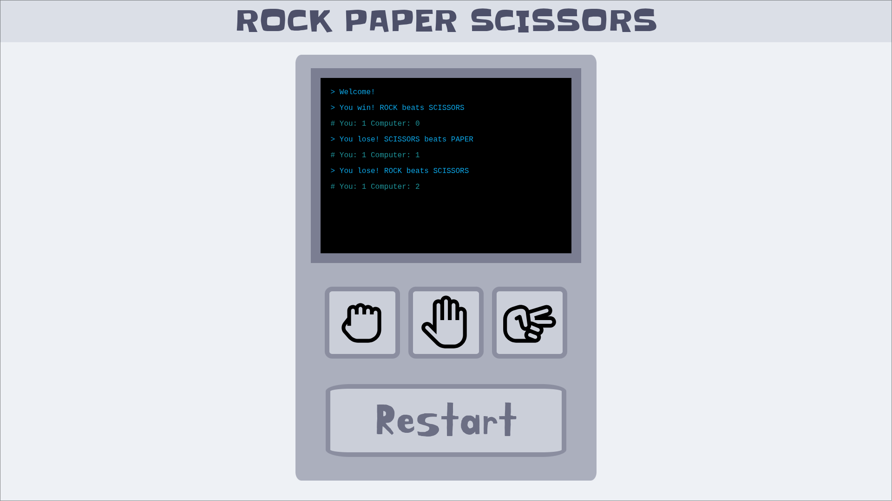
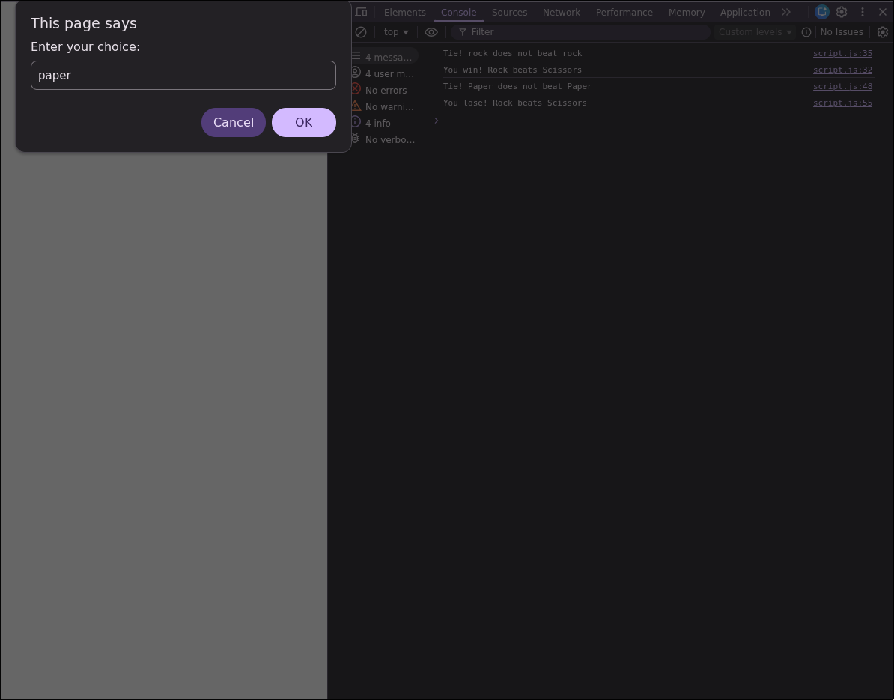

# Rock-Paper-Scissors

Implementation of a five-round game of **Rock Paper Scissors** from [The Odin Project](https://www.theodinproject.com/) curriculum.

Live webpage can be accessed [here](https://warhand40k.github.io/Rock-Paper-Scissors/).

### Phase 1:

* A simple implementation of the game that is playable only in the browser console.

### Phase 2:

* Added UI without changing the core logic of the game.
* Enjoyed learning DOM and Events.

## Skills demonstrated

* HTML
* CSS
* Javascript
